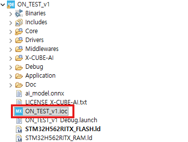
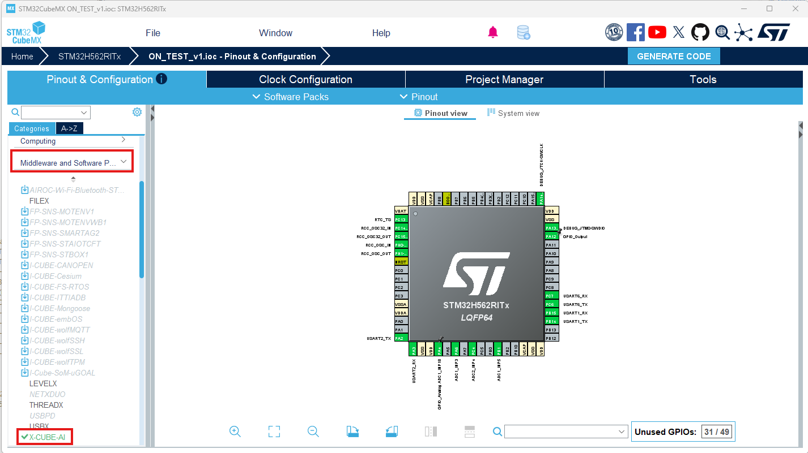
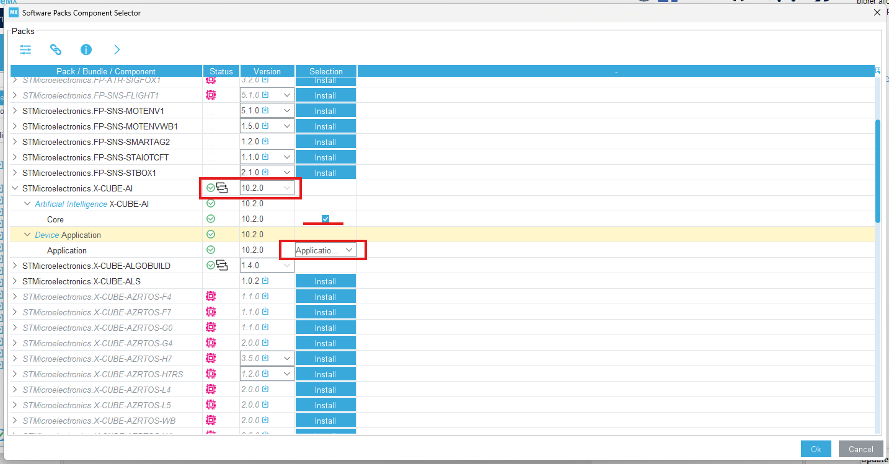
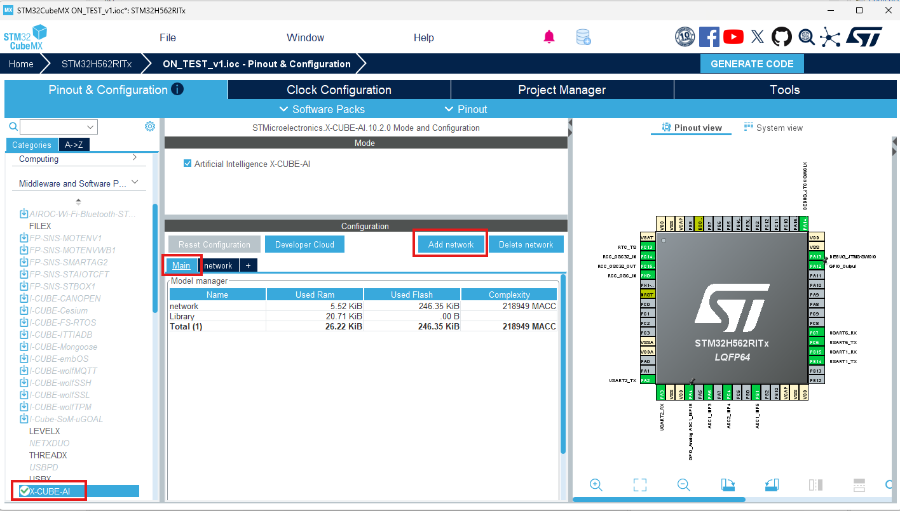
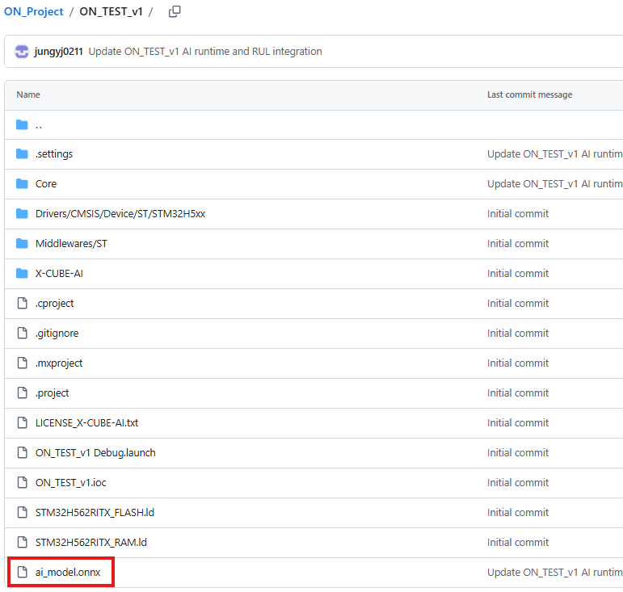
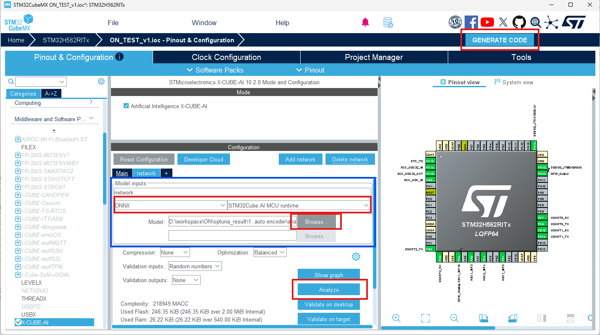

# X-CUBE-AI 설정 및 ONNX 모델 적용

### 1. 프로젝트 `.ioc` 파일 실행

STM32CubeIDE에서 대상 프로젝트의 `.ioc` 파일을 실행한다.

`.ioc` 파일을 실행하면 STM32CubeMX의 `Pinout & Configuration` 화면이 열린다.

### 2. X-CUBE-AI 컴포넌트 설정

왼쪽 `Categories` 메뉴에서 `Middleware and Software Packs`를 선택한 후
`X-CUBE-AI`를 선택한다.

X-CUBE-AI가 설치되어 있지 않거나 버전 및 컴포넌트 설정을 확인해야 하는 경우
`Software Packs > Select Components`에서 X-CUBE-AI 설정을 확인한다.

### 3. X-CUBE-AI 버전 및 Application 설정

`Software Packs Component Selector`에서 다음 항목을 확인한다.

- X-CUBE-AI Version: `10.2.0`
- `Core` 체크 여부 확인
- `Device Application > Application` 선택
- 설정 완료 후 `OK` 선택

본 프로젝트에서는 X-CUBE-AI `10.2.0`을 기준으로 한다.

### 4. 기존 네트워크 삭제 및 신규 네트워크 추가

왼쪽 메뉴에서 `X-CUBE-AI`를 선택한다.

기존에 등록된 네트워크가 있는 경우 다음 순서로 삭제한다.

1. `Main` 이외의 기존 Network 탭 선택
2. `Delete network` 선택
3. 기존 Network가 삭제되어 `Main`만 남아 있는지 확인
4. `Add network` 선택하여 새로운 네트워크 추가

신규 네트워크의 이름은 `network`를 사용한다.

> 기존 네트워크가 없는 경우 삭제 과정 없이 바로 `Add network`를 선택한다.

### 5. ONNX 모델 파일 확인

프로젝트 Root 경로에 추론에 사용할 `ai_model.onnx` 파일이 포함되어 있는지 확인한다.

본 프로젝트에서는 다음 모델 파일을 사용한다.

`ai_model.onnx`

### 6. ONNX 모델 등록 및 Analyze

추가한 Network에서 `Model inputs`를 다음과 같이 설정한다.

- Model Type: `ONNX`
- Runtime: `STM32Cube.AI MCU runtime`
- Model: 프로젝트에 포함된 `ai_model.onnx`
- Compression: `None`
- Optimization: `Balanced`

`Browse...` 버튼을 선택하여 프로젝트의 `ai_model.onnx` 파일을 등록한다.

모델 등록 후 `Analyze` 버튼을 선택한다.

Analyze가 정상적으로 완료되면 모델의 RAM, Flash 및 Complexity 정보가 표시되는지 확인한다.

본 프로젝트의 네트워크 이름은 `network`를 사용한다.

### 7. 코드 생성

모델 Analyze 완료 후 화면 오른쪽 상단의 `GENERATE CODE`를 선택하여
X-CUBE-AI 설정 및 네트워크 코드를 프로젝트에 반영한다.

코드 생성 후 다음 디렉터리 및 파일이 생성되었는지 확인한다.

- `X-CUBE-AI/App/app_x-cube-ai.c`
- `X-CUBE-AI/App/app_x-cube-ai.h`
- `X-CUBE-AI/App/network.c`
- `X-CUBE-AI/App/network.h`
- `X-CUBE-AI/App/network_data.c`
- `X-CUBE-AI/App/network_data.h`
- `X-CUBE-AI/App/network_data_params.c/.h`
- `Middlewares/ST/AI/`

> [!WARNING]
> STM32CubeMX에서 `GENERATE CODE`를 다시 실행하면 자동 생성 영역의 코드가
> 삭제되거나 다시 생성될 수 있다.
>
> 사용자 작성 코드는 가능한 한
> `/* USER CODE BEGIN ... */`와 `/* USER CODE END ... */`
> 사이에 작성한다.
